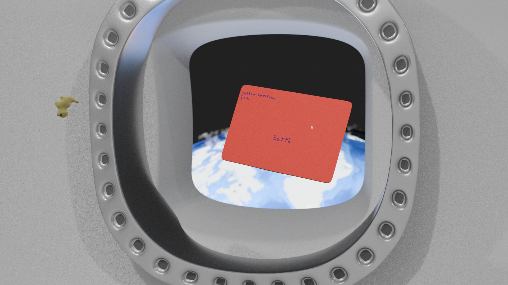

I just finished my speed scene of an astronaught sending a letter to earth. I wanted to see just how long that would take me for a basic render and it's about 2.5 hrs

Everything was hand textured and modeled except for the earth, I stole an image from nasa because theirs are extremely high quality

Enjoy!

